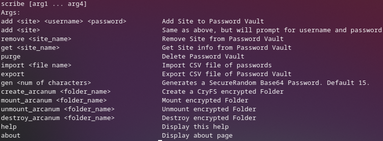

# Scribe
A Simple to use CLI Password Manager written in Ruby. Passwords are encrypted in AES-256-CBC. It also can make CryFS encrypted folders!

# Features
- Add, Display and Modify Passwords!
- Import and Export Passwords!
- Delete Passwords!
- Export your passwords!
- Search by Site name to get passwords!
- Display when it was last modified!
- Delete entire Password Vault!
- Generate Base64 Passwords!
- Make, Mount, and Destroy CryFS folders!

# Usage
Clone Repo and run `bundle install`.

# Issues
- On OpenBSD, SQLite will show encoding warnings, most likely due to Pledge, warnings are suppressed until tweaked.

# Things that's being worked (AKA, I am tired, I want to sleep..)
- Make it packaged.
- Sleeping.
